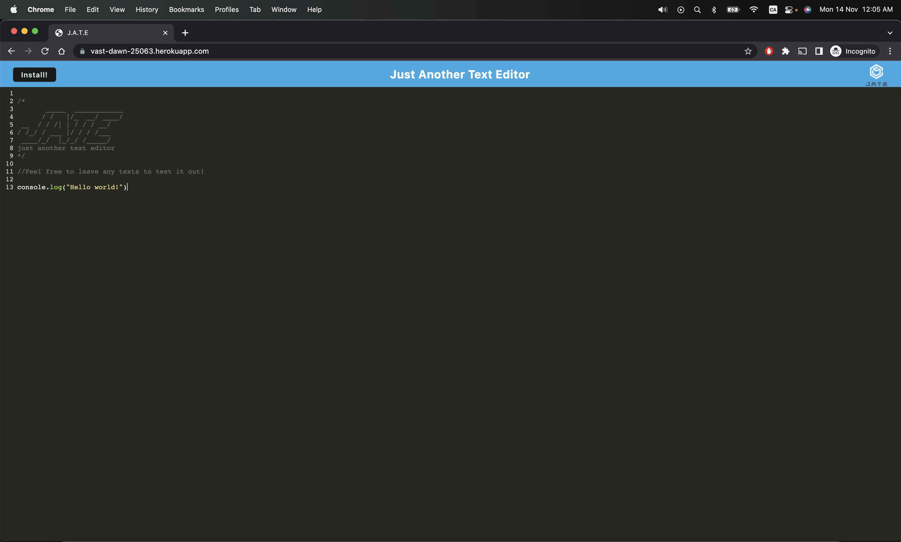
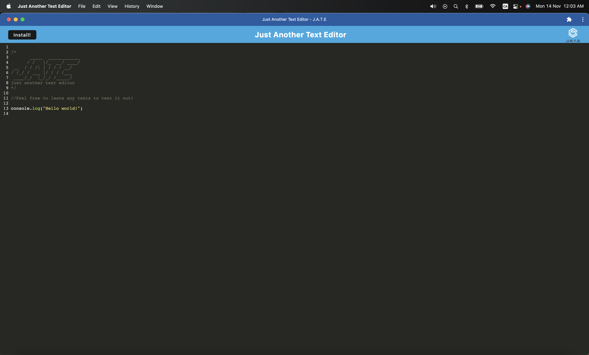

# 19-PWA-Challenge

## Deployed Link

https://vast-dawn-25063.herokuapp.com/

## Link to GitHub Repo

https://github.com/paksin/19-PWA-Challenge

## Description

This challenge is to build a text editor that runs in the browser. The app will be a single-page application that meets the PWA criteria. Additionally, it will feature a number of data persistence techniques that serve as redundancy in case one of the options is not supported by the browser. The application will also function offline.

This text editor implemented methods for getting and storing data to an IndexedDB database by using a package called `idb`, which is a lightweight wrapper around the IndexedDB API. It features a number of methods that are useful for storing and retrieving data, and is used by companies like Google and Mozilla.

## Mock-Up

